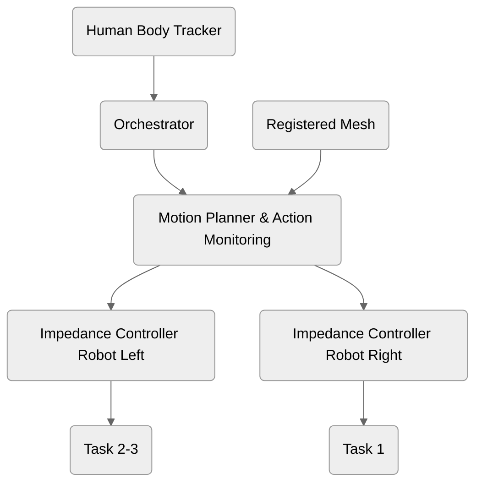

# inverse-demo
## Task description
- Task 1: The robot on the right pick and place the small block on the right to the mounting and the operator screw the two screws.  
- Task 2: The robot on the left pick and place the big block on the left over the right hole using a visuo/tactile peg-in-hole strategy, then it keep it in place while the human screws it.
- Task 3: The robot on the left, fully autonomously pick the cable and put it on the plug using a visuo/tactile peg-in-hole strategy

## Project Scheme
This following scheme is the block diagram of the demo:

## Installation
TODO: specify vcs import dependencies

### Human Body Tracker
To install the human body tracker, please follow the instructions in the [human bo  dy tracker repository](https://github.com/idra-lab/smpl_ros) which also needs the [torchure_smplx](https://github.com/Hydran00/torchure_smplx).
