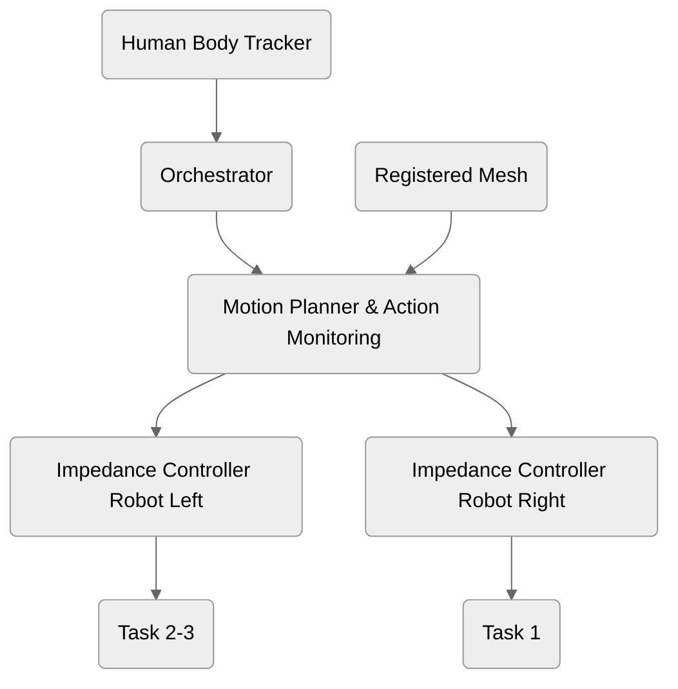
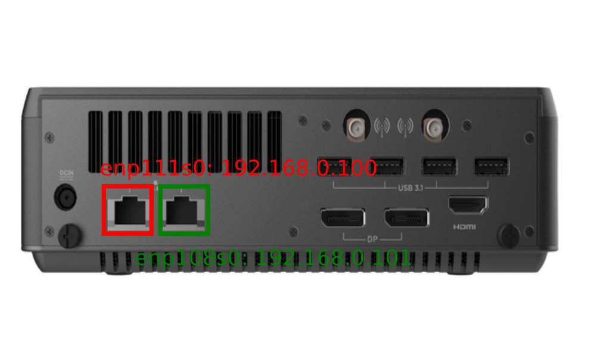

# Inverse Demo

## Dependencies

### Packages

For moving the Frankas:

- [`franka_description`](https://github.com/frankarobotics/franka_description/) for the Franka URDFs;
- [`franka_ros2`](https://github.com/frankarobotics/franka_ros2) for the ROS2 franka integration. This, in turn, requires [`libfranka`](https://github.com/frankarobotics/libfranka) to be installed on the machine;
- [`franka_ros2_multimanual`](https://github.com/idra-lab/franka_ros2_multimanual) for the bimanual setup hardware interface;

For the motion planner:

- clone the [`mdvcpplib`](https://github.com/matteodv99tn/mdv_cpp_lib) on the `inverse` branch in the ROS 2 workspace;

For the human body tracker:

1. install the [`torchure_smplx`](https://github.com/Hydran00/torchure_smplx) library (more instructions there).
1. put in the workspace src the [`smpl_ros`](https://github.com/idra-lab/smpl_ros) library by following the instructions in the corresponding repository.


### Submodules modifications
- Change F/T sensor name under `bota_ft_sensor_driver/rokubimini_serial/rokubimini_serial.launch.py` to the right model (e.g. BFT-DENS-SER-M8)
- If compilations error in `mdv_cpp_lib` arise, comment the line `#include <rerun/archetypes/series_points.hpp>` in both `rerun.cpp` and `rerun.hpp`


### Rosdep

All other dependencies for the ROS 2 packages can be easily installed through `rosdep`:

1. update the package list `sudo apt-get update`;
1. update the rosdep database `rosdep update`;
1. install the dependencies:
   ```
   rosdep install --ignore-src -y --from-paths </path/to/ws>/src
   ```

### Virtual environment

OpenCV requires `numpy<2.0` thus conflicts with the system-installed numpy version.
For this reason, prepare a separate virtual environment with pinned library versions:

- create virtual environment:
  ```bash
  /usr/bin/python3 -m venv --system-site-packages ~/venvs/ros-aruco
  ```
- source it:
  ```bash
  source ~/venvs/ros-aruco/bin/activate
  ```
- install pinned dependencies:
  ```bash
  python -m pip install "numpy==1.26.4" \
    "opencv-contrib-python-headless==4.10.0.84"
  ```

## Task description
- Task 1: The robot on the right pick and place the small block on the right to the mounting and the operator screw the two screws.
- Task 2: The robot on the left pick and place the big block on the left over the right hole using a visuo/tactile peg-in-hole strategy, then it keep it in place while the human screws it.
- Task 3: The robot on the left, fully autonomously pick the cable and put it on the plug using a visuo/tactile peg-in-hole strategy

### Project Scheme
This following scheme is the block diagram of the demo:

```mermaid
---
config:
  theme: 'neutral'
---
graph TD;
    A(Orchestrator)-->B(Motion Planner & Action Monitoring);
    C(Registered Mesh)-->B
    B-->D(Impedance Controller Robot Left);
    B-->E(Impedance Controller Robot Right);
    F(Human Body Tracker)-->A(Orchestrator);
    D-->G(Task 2-3);
    E-->H(Task 1);
```


## Running the code

### Main tasks execution

1. On one terminal launch the following:
   ```
   ros2 launch inverse_bringup inverse_ur.launch.py
   ```
   This will:

   - create the connection with the UR robot; the robot will start using the `cartesian_compliance_controller` with the parameters defined in the [`ur_controllers.yaml`](inverse_bringup/config/ur_controllers.yaml) file;
   - spawn RViz;
   - TODO: add all frames to the launch file
   - start the motion planner.
1. On another terminal, start the zed camera and SMPL body tracker nodes with the following commands:
   ```
   source ~/venvs/ros-aruco/bin/activate && ros2 launch smpl_ros cams.launch.py
   ```
1. For starting the execution of the actual task, on another terminal you must run the orchestrator as follows:
   ```
   ros2 run inverse_orchestrator orchestrator
   ```
   To properly decide which task to execute, you must first make sure to update the [`orchestrate`](https://github.com/idra-lab/inverse-demo/blob/faac88be8ce0415ba8300680b065f9e9fffc180c/inverse_orchestrator/inverse_orchestrator/orchestrator.py#L61-L63) function within the `Orchestrator` node defined in [`orchestrator.py`](./inverse_orchestrator/inverse_orchestrator/orchestrator.py).

   As of now, within the program execution, the human input is required as trigger to continue the motion plan. This can be simply achieved by pressing _enter_ on the keyboard whenever the robot is in grasp/release position. The robot will then take care to resume the execution.


### Skill recording

To record the a human skill (DMP based) that then can be executed by the robot:

1. Use the [following launch file](./inverse_bringup/launch/teach.launch.py) to start the robot in gravity compensation
   ```
   ros2 launch inverse_bringup teach.launch.py
   ```
1. Once the robot is in the desired initial configuration, call the service `/learn_skill` as follows:
   ```
   ros2 service call /learn_skill inverse_msgs/srv/LearnSkill "
        skill_name: ''
        registration_duration_secs: 10.0
        num_basis: 30"
   ```
   Feel free to adjust the parameters at your will. About the number of basis, chose a low number (10-12) if you need to do a simple task, while increase up to 40-50 for very complex motions.

**Note:**
When learning, only 1 trajectory of the robot is actually recorded. The recorded pose is the one of a TF2 transform of the frame specified in the [`node_parameters.yaml`](./inverse_bringup/config/node_parameters.yaml) file, specifically in the [arguments for the `skill_learner` node](https://github.com/idra-lab/inverse-demo/blob/faac88be8ce0415ba8300680b065f9e9fffc180c/inverse_bringup/config/parameters.yaml#L23-L30).
For the setup with UR, the `tool0` frame is reference to the TCP of the robot.

# CRF Setup

## Network configuration

1. The computer connecting to the robot must be configured with:
   ```
   ip address: 192.168.3.10
   netmask: 255.255.255.0
   gateway: 192.168.3.1
   ```
2. On the teach pendant of the UR10 robot, from the start, do the following:
   1. From the main menu, select `Program Robot`;
   1. Go to the `Installation` tab, and reach for the `External Control` section in the left ribbon;
   1. Set:
      ```
      host ip: 192.168.3.2
      custom port: 50002 (default)
      host name: 192.168.3.10
      ```
## Cabling

The cables of the Robotiq gripper and of the Robotiq force-torque sensor **must both be connected the PC**, and not the UR control box.
If running `ros2 launch inverse_bringup inverse_ur.launch.py` doesn't start the robot, try to switch the USB cables of the Robotiq devices.

As last resort, you may need to check the `/dev/ttyUSB<x>` devices, and properly update the fields in `inverse-demo/easy_ur_control/urdf/ur_wrapper.xacro`.

## Fixing Robotiq FT baudrate

Sometimes we noticed that the Robotiq FT sensor has problems in properly connecting; on the terminal you may observe

```
[ur_ros2_control_node-1] [INFO] [1791275792.863111850] [RobotiqFTSensorHardware]: Waiting for sensor connection...
[ur_ros2_control_node-1] [INFO] [1791275794.405334685] [RobotiqFTSensorHardware]: ret is -1
[ur_ros2_control_node-1] [INFO] [1791275794.405370650] [RobotiqFTSensorHardware]: Waiting for sensor connection...
[ur_ros2_control_node-1] [INFO] [1791275795.949795204] [RobotiqFTSensorHardware]: ret is -1
```

Empirical evidence told us that the problem may be of a wrongly hard-coded baudrate in the `robotiq_ft_sensor_hardware/src/rq_sensor_com.cpp` (`rq_fts_ros2_driver` package).
Once we had it working by switching from `B19200` to `B115200`; to test this fix, run from the root of the `inverse-demo` repository the following command:

```bash
sed -i 's/\bB19200\b/B115200/g' rq_fts_ros2_driver/robotiq_ft_sensor_hardware/src/rq_sensor_com.cpp
```

## ROS 2 Configuration

Ensure the following lines are present in the `~/.bashrc`:

```bash
export ROS_DOMAIN_ID=11
export ROS_LOCALHOST_ONLY=0
export RMW_IMPLEMENTATION=rmw_cyclonedds_cpp
```

# Zotac PC configuration

- User: `inverse`
- Password: `inverse`

The following are the default configuration for the IP addresses of the computer:


